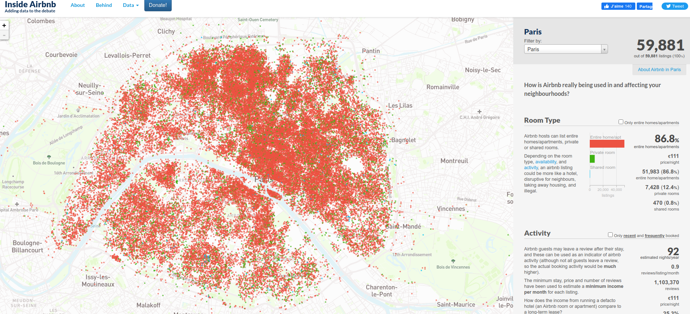

# PySpark-Projects
Here I some stuff I do with pySpark
## Pipeline_and_Ml_basics_Pyspark
It contains the basic commands to make pipelines with pyspark, it is a quick reminder.

## AirBnB_paris_regression
This is a small project where I've taken data from Airbnb to predict the price of rooms in Paris.

  

